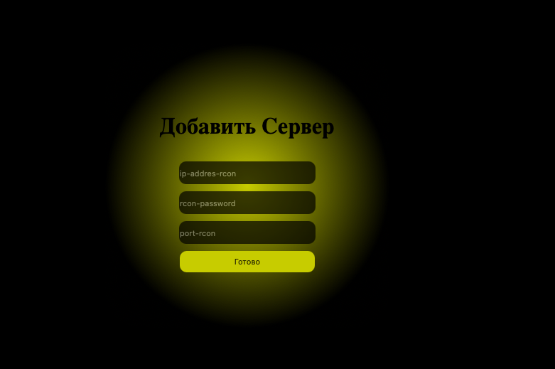
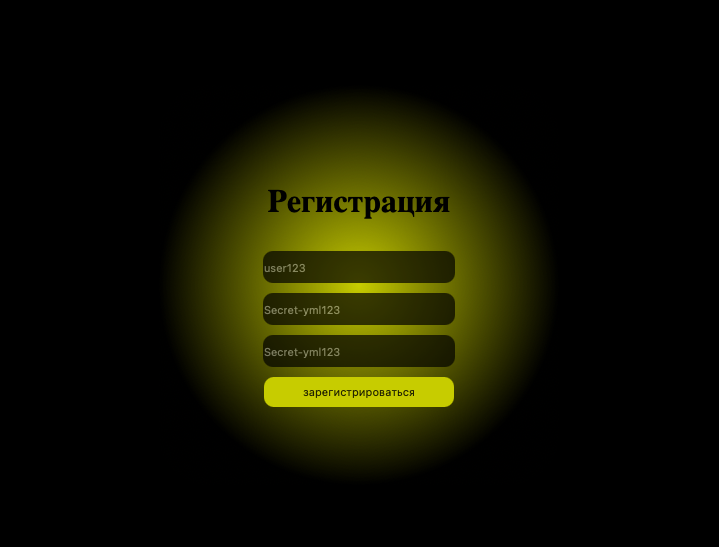
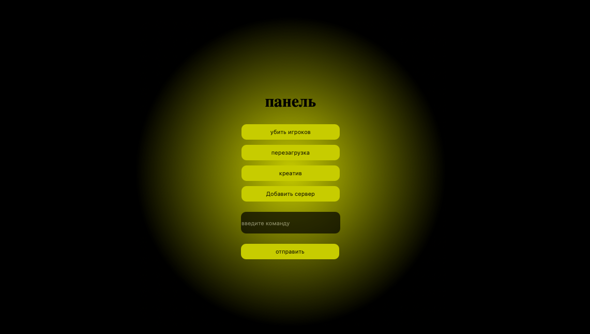

# Minecraft-panel
Управляйте своим майнкрафт севрером в панели!
## Возможности
- управление сервером локально
- отправка любой команды в консоль
- добавление своего сервера через форму
## фотокарточки



##  Зависимости:
- Python 3.14
- Django 
- mctools
## Установка
```bash
git clone https://github.com/Dr-Yoo/Minecraft-panel
cd Minecraft-panel
python3 -m venv venv
source venv/bin/activate
pip install -r requirements.txt
python3 manage.py migrate
python3 manage.py runserver
```
## У меня нет майнкрафт сервера!
Вот тестовый вариант:
- версия: 1.21.11
- HOST = "95.216.123.235" 
- PORT = 25590
- PASSWORD = "7IdvrbWFnl"


